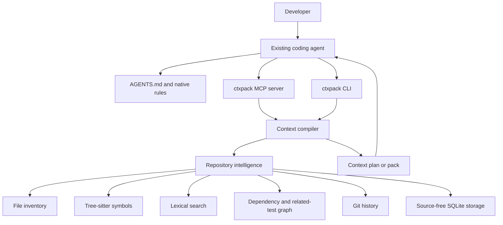
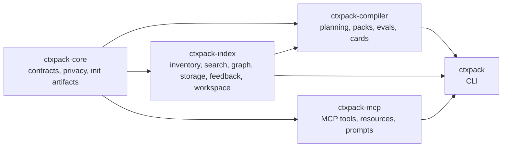
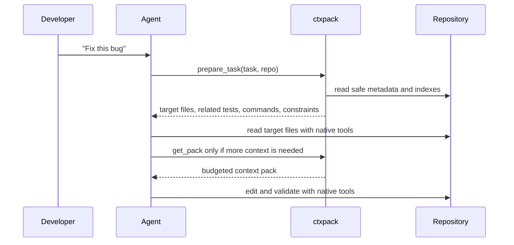
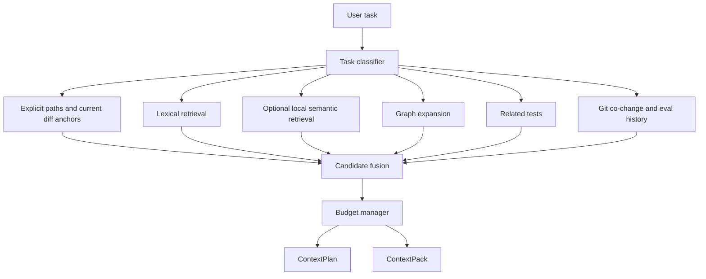
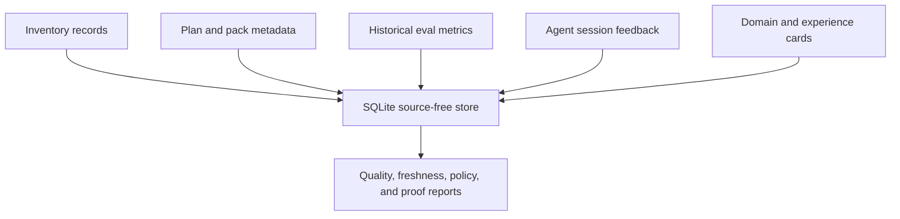
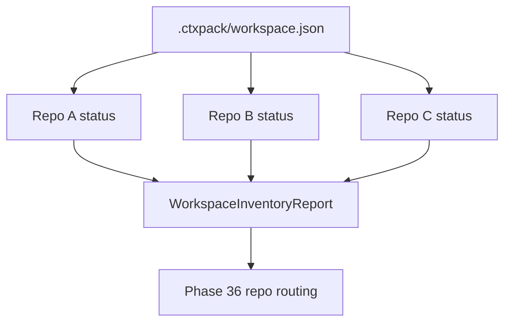

# ctxpack Architecture

ctxpack is a local-first context broker for coding agents. It does not edit
code, own the chat UI, or replace an agent. Its job is to compile small,
evidence-labeled context plans and packs so existing agents inspect better
files, tests, examples, and constraints.

## System Shape

The important boundary is read-only context. Agents use their own file read,
edit, and shell tools after ctxpack tells them where to look.

## Documentation Map

- [Component guide](components.md) explains each crate and capability boundary.
- [Data contracts](data-contracts.md) documents public JSON contracts and
  source-free rules.
- [Context compiler](context-compiler.md) documents retrieval, ranking, and
  packing.
- [Pack inspector](inspector.md) documents source-free pack decision exports.
- [Agent preview](agent-preview.md) documents how each coding agent should
  consume ctxpack tools, resources, guidance, and pack URIs.
- [Retrieval health](retrieval-health.md) documents source-free context-quality
  reports.
- [Graph neighborhoods](graph.md) documents source-free relationship reports.
- [Workspace manifests](workspace.md) documents local multi-repo workspace
  state.
- [Agent integrations](integrations.md) documents AGENTS.md, MCP, and native
  rules.
- [Storage](storage.md), [memory](memory.md), [feedback](feedback.md),
  [semantic retrieval](semantic.md), [precision](precision.md), and
  [benchmarking](benchmarking.md) document deeper subsystems.

## Crate Map

## Runtime Flow

## Context Pipeline

The design is hybrid by intent. Exact identifiers, paths, and stack traces often
beat embeddings for code. Semantic retrieval helps conceptual tasks, but it is
optional and local by default.

## Storage And Memory

Storage records metadata, hashes, paths, counts, metrics, selected candidate
IDs, and privacy flags. It does not store raw file contents, prompts, terminal
logs, model transcripts, or source snippets.

## Workspace Layer

Phase 35 introduces the manifest and status report only. Cross-repo task routing
and workspace-aware packs depend on this inventory foundation and arrive later.

## Major Decisions

| Decision | Current choice | Trade-off |
| --- | --- | --- |
| Product surface | AGENTS.md, MCP, thin CLI | Keeps users inside existing agents, but requires careful adapter docs |
| Editing behavior | Read-only | Complements agent permission models, but cannot repair code itself |
| Default retrieval | Lexical, graph, tests, history | Strong for code identifiers and validation, but conceptual queries may need semantic retrieval |
| Semantic search | Optional local hash vectors | Preserves privacy, lower quality than cloud code embeddings |
| Storage | SQLite plus source-free records | Easy to ship and inspect, not a distributed team database |
| Workspace state | Local manifest | Simple and trusted, no hosted sync yet |
| Generated memory | Source-linked cards | Useful durable context, but must be freshness-checked |
| Evaluation | Historical commits plus feedback | Measures value, but repository-specific labels are noisy |

## Safety Invariants

- ctxpack does not edit source files.
- ctxpack does not mutate global Codex, Claude, Cursor, or OpenCode config.
- Cloud embeddings, cloud reranking, and hosted sync are not default behavior.
- Public reports include `sourceTextLogged: false` where they summarize agent
  sessions, workspace status, feedback, or eval artifacts.
- Sensitive and generated paths are excluded from source-bearing workflows by
  default and represented only as counts or diagnostics.

## How To Read The Code

Start with the contracts in `crates/ctxpack-core/src/contracts.rs`. Then follow
the implementation by capability:

- inventory and ignore policy: `crates/ctxpack-index/src/inventory.rs`
- source-read policy: `crates/ctxpack-index/src/policy.rs`
- lexical retrieval: `crates/ctxpack-index/src/search.rs`
- symbols and dependencies: `crates/ctxpack-index/src/symbols.rs` and
  `crates/ctxpack-index/src/dependencies.rs`
- context planning: `crates/ctxpack-compiler/src/planning.rs`
- pack rendering: `crates/ctxpack-compiler/src/packs.rs`
- CLI surfaces: `crates/ctxpack/src/main.rs`
- MCP surfaces: `crates/ctxpack-mcp/src/lib.rs`
- workspace foundation: `crates/ctxpack-index/src/workspace.rs`
