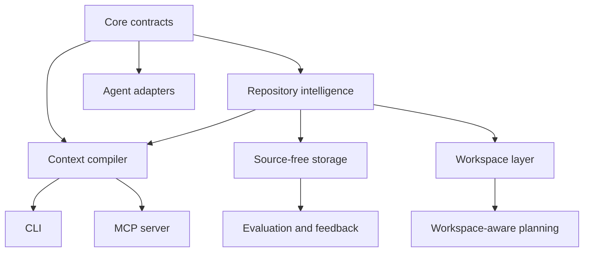

# Component Guide

This guide breaks ctxpack down by component. Use it with
[architecture.md](architecture.md) when you need to understand where a feature
belongs or what trade-off a module owns.

## Component Map

## `ctxpack-core`

Owns public contracts and stable project setup behavior.

Primary responsibilities:

- JSON contracts such as `ContextPlan`, `ContextPack`, `EvalTrace`,
  feedback/policy reports, memory cards, and workspace reports
- privacy status types
- repo discovery
- `ctxpack init` generated AGENTS/native-rule artifacts
- setup-check contracts

Design constraints:

- contracts serialize as stable camelCase JSON unless an enum intentionally uses
  snake_case
- source-free reports must not expose raw source, prompts, terminal logs, or
  model transcripts
- setup artifacts stay repo-local and guidance-only

## `ctxpack-index`

Owns repository intelligence extracted from local repositories.

Primary responsibilities:

- safe file inventory and ignore handling
- source-read policy and sensitive/generated classification
- lexical search
- symbol extraction
- dependency edges
- related-test mapping
- git co-change and current-diff signals
- optional local semantic metadata
- source-free SQLite storage
- feedback and policy-profile storage
- workspace manifest/status support

Design constraints:

- default-deny sensitive and generated source-bearing reads
- keep output source-free unless a caller explicitly asks for safe snippets
- prefer diagnostics over panics when repository state is stale, missing, or
  partially inaccessible

## `ctxpack-compiler`

Owns task-conditioned context selection.

Primary responsibilities:

- classify task shape enough to choose retrieval weights
- fuse lexical, symbol, graph, test, history, semantic, current-diff, and memory
  signals
- rank and diversify candidates
- compile `ContextPlan`
- compile budgeted `ContextPack`
- compile source-free agent preview reports
- run historical evals and benchmark suites
- emit source-free, resource-backed retrieval-gap summaries with context-area
  URIs and bounded next-read paths
- generate source-free domain and experience cards

Design constraints:

- do not dump the repo into context
- keep exact paths, line hints, evidence reasons, and validation commands visible
- prefer plan-first progressive disclosure over immediate deep packs
- preserve single-repo behavior unless the caller explicitly uses workspace
  commands

## `ctxpack-mcp`

Owns agent-native runtime integration.

Primary responsibilities:

- stdio JSON-RPC MCP server
- small tool surface: `prepare_task`, `search`, `related`, `get_pack`,
  `related_tests`, `current_diff`
- repo resources, file resources, test-map resources, source-free context-area
  resources, and pack resources
- workflow prompts for agents

Design constraints:

- keep tool count small
- use resource URIs for larger context
- keep context-area resources source-free; agents must use native reads for
  source text
- expose `roleCounts` and `selectedRoleCounts` in plan-level context areas so
  agents can tell whether a broad area is source-heavy, validation-heavy, or
  docs-only before progressive reads
- expose path counts, role buckets, path families, and next-read batches in
  context-area resources so broad tasks can progress without extra tools
- label context-area resources with `resourceScope.kind = safeInventoryArea`,
  `taskConditioned = false`, and `countsSource = safeInventory` so agents do
  not confuse inventory-wide resource counts with task-conditioned plan counts
- resolve repo-scoped resources from the last explicit tool repo when the MCP
  server cwd is outside the workspace
- keep pack resources session-scoped
- never mutate source files or global agent config

## `ctxpack` CLI

Owns local operator and smoke-test surfaces.

Primary responsibilities:

- expose every core capability as deterministic commands
- provide JSON and Markdown outputs where useful
- preview Codex, Claude Code, Cursor, OpenCode, and generic MCP consumption
- support release smokes and regression tests
- serve MCP

Design constraints:

- CLI is plumbing, not the daily product center
- output should be source-free by default
- changing CLI contracts requires compatibility tests

## Storage, Memory, And Feedback

Storage is a source-free SQLite layer, not a code warehouse.

Stored examples:

- file paths, roles, hashes, and counts
- symbol names and ranges
- selected candidate IDs
- eval metrics and retrieval gaps
- memory card summaries
- feedback event metadata

Rejected examples:

- raw source text
- prompts
- terminal logs
- model transcripts
- secret values

## Workspace Layer

The workspace layer starts with `.ctxpack/workspace.json`, then builds toward
workspace-aware planning.

Phase 35:

- define local repos
- inspect source-free status
- report diagnostics

Phase 36:

- route tasks to likely repos
- emit repo-boundary-aware plans
- keep per-repo retrieval inside selected repos

Later phases:

- shared source-free artifacts
- team policy templates
- agent-native workspace release gates

## Feature Placement Rule

Use this rule when adding features:

- stable public JSON type: `ctxpack-core`
- local repo metadata extraction: `ctxpack-index`
- task-conditioned ranking or packs: `ctxpack-compiler`
- agent protocol surface: `ctxpack-mcp`
- operator command or smoke hook: `ctxpack`
- durable docs and trade-offs: `docs/`
