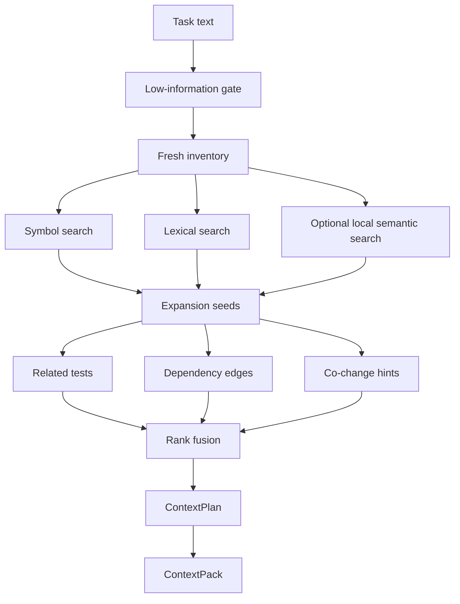
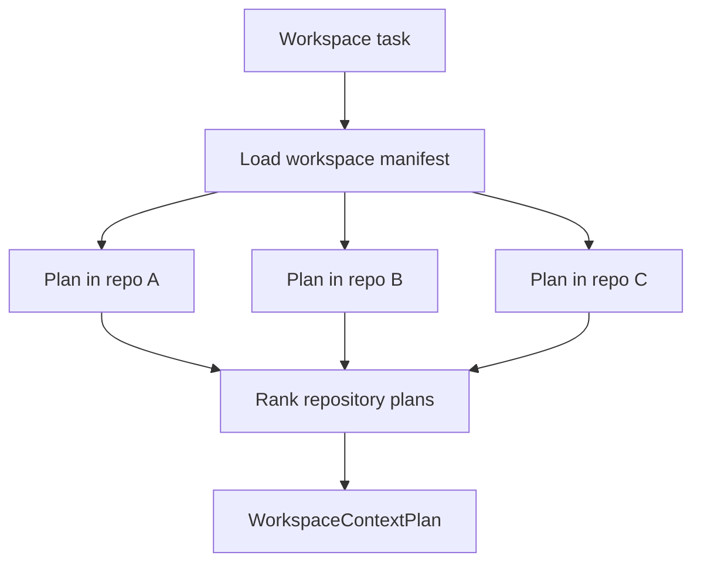

# Context Compiler

The context compiler is the product core. It turns a task into a small,
evidence-labeled plan or pack.

## Pipeline

## Retrieval Signals

| Signal | Best for | Notes |
| --- | --- | --- |
| explicit path anchors | open files, user-mentioned files | highest-confidence starting point |
| current diff | reviewing or extending local work | source-free path labels only |
| lexical search | identifiers, errors, routes, config keys | often stronger than embeddings for code |
| symbol search | functions, classes, methods, types | preserves line hints |
| dependency graph | callers, callees, imports | one-hop expansion by default |
| related tests | validation strategy | high-value for bug fixes |
| git history | regressions and co-change patterns | degrades when git is unavailable |
| semantic search | conceptual queries | optional and local by default |
| memory cards | durable repo patterns | selected under freshness/review constraints |

## Ranking And Budgeting

Ranking uses multiple source scores rather than trusting one retriever. Selection
then diversifies candidates across roles and paths so one noisy file family does
not consume the whole plan.

Pack budgeting keeps source snippets, tests, memory, and supporting evidence
bounded. Brief packs stay small. Deep packs are explicit and should be rare.

## Diagnostics

The compiler prefers degraded output with diagnostics over hard failure. Common
diagnostics include stale inventory rebuilds, low-information tasks, unavailable
anchors, missing git history, and trace write failures.

## Trade-Offs

- Hybrid retrieval is more engineering work than a single vector index, but code
  tasks need exact identifiers, graph structure, tests, and history.
- Local semantic retrieval is weaker than cloud code embeddings, but it preserves
  trust and keeps cloud processing opt-in.
- Snippets improve usability, but every snippet is revalidated against current
  safe inventory before materialization.
- Large packs increase recall, but can hurt model attention and latency; plan
  first, pack later is the safer default.

## Workspace-Aware Planning

Workspace planning wraps the same single-repo compiler rather than merging all
repositories into one search space.

This preserves repo boundaries and lets agents see which repository each
recommendation came from before reading files. Workspace packs preserve the same
boundary by returning `repoPacks`, each with a nested single-repo `ContextPack`,
instead of flattening snippets from different repositories into one section.
File-level retrieval runs inside each member repo and the workspace layer ranks
whole repo plans.
