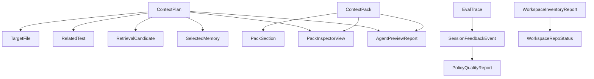

# Data Contracts

ctxhelm contracts are the boundary between the retrieval engine, CLI, MCP, and
agents. They should be small, typed, additive, and source-free by default.

## Contract Families

## Compatibility Rules

- Use `#[serde(rename_all = "camelCase")]` for public structs.
- Use explicit enum casing when existing contracts already depend on it.
- Add fields with `#[serde(default)]` when older JSON should remain readable.
- Do not rename public JSON fields without a compatibility migration.
- Tests should assert both positive field presence and absent source-bearing
  aliases.

## Source-Free Fields

Preferred fields:

- repo IDs
- path labels
- file roles
- counts
- hashes
- line ranges
- confidence scores
- reason codes
- diagnostic codes
- privacy flags

Forbidden fields in public reports unless a feature is explicitly a safe snippet
resource:

- `source`
- `sourceText`
- `sourceTextLogged: true`
- `prompt`
- `terminalLog`
- `transcript`
- raw commit subjects when they may contain user text

## Context Contracts

`ContextPlan` answers: what should the agent inspect first?

It includes target files, related tests, commands, risk flags, diagnostics,
retrieval candidates, selected memory, and privacy status.

`ContextPack` answers: what bounded evidence should the agent load now?

It includes ordered sections, token estimates, warnings, diagnostics, and
privacy status.

`PackInspectorView` answers: how did ctxhelm select and package evidence?

It links a `ContextPlan` and `ContextPack` through pack/task/repo IDs, target
agent, budget, token estimate, warnings, diagnostics, selected memory,
retrieval candidates, related tests, validation commands, and section metadata.
It never copies `PackSection.content`; source-bearing sections are labeled with
`sourceBearing: true` and `sourceTextLogged: false`. See
[Pack inspector](inspector.md).

`AgentPreviewReport` answers: how should a target coding agent consume ctxhelm?

It exposes target agents, MCP tool names, MCP resource URIs, AGENTS/native-rule
guidance paths, pack resource URIs, recommended next steps, and the read/edit
ownership boundary. It is source-free; source-bearing snippets remain limited
to explicit pack materialization. See [Agent preview](agent-preview.md).

## Memory And Feedback Contracts

Memory cards summarize durable repo patterns while preserving source links and
input hashes instead of source text. Feedback contracts record source-free
session outcomes so retrieval policy can improve without storing model
transcripts.

## Workspace Contracts

`WorkspaceManifest` is the local definition:

- schema version
- optional workspace ID
- repo paths
- optional repo IDs
- labels and tags

`WorkspaceInventoryReport` is the source-free status view:

- workspace root and manifest path
- repo counts
- file/generated/sensitive counts
- storage compatibility labels
- memory card counts
- diagnostics
- `sourceTextLogged: false`

Later workspace planning contracts should keep repo IDs and labels explicit so
agents never confuse evidence from different repositories.
