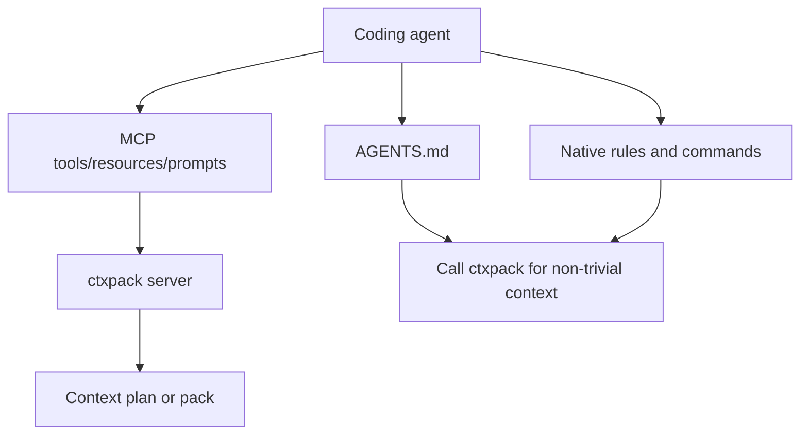

# Agent Integrations

ctxpack is agent-native: the daily workflow stays inside Codex, Claude Code,
Cursor, OpenCode, and other MCP-compatible coding agents.

## Integration Layers

## AGENTS.md

AGENTS.md is the broadest compatibility layer. It should contain stable,
high-signal behavior:

- call ctxpack for non-trivial code changes
- read target files with native tools
- request larger packs only when needed
- run targeted validation commands when returned

It should not contain huge generated repo summaries.

## MCP

MCP is the dynamic runtime layer. Current tool surface is intentionally small:

- `prepare_task`
- `search`
- `related`
- `get_pack`
- `related_tests`
- `current_diff`

Large content belongs behind resources, not additional tools.

Workspace metadata is also exposed as resources rather than new tools:

- `ctxpack://workspace/status`
- `ctxpack://workspace/shared-artifacts`

Agents can load these when they need multi-repo status or team artifact
metadata. This keeps the model-facing tool decision set stable while still
making workspace context available.

## Native Rules

Cursor rules, Claude commands, and OpenCode snippets are thin adapters. They
should guide behavior without duplicating ctxpack internals.

## Trade-Offs

- Keeping ctxpack read-only avoids competing with agent permission/editing
  models.
- Keeping the MCP tool surface small reduces context overhead.
- Static docs help cloud or isolated tasks, but dynamic MCP is better for fresh
  local state.
- Real-client proof is useful but environment-sensitive, so deterministic MCP
  protocol smoke remains the release baseline.
